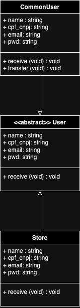

# TonberryPay

_Pay me or i'll stab you_

Repo pra treinar com esse desafio aqui: https://github.com/PicPay/picpay-desafio-backend?tab=readme-ov-file

## Definições Técnicas

### Tecnologias 🚀

### Desenho de Solução 🏢

Desconsiderando o sistema de cadastro de Usuários, a solução do TonberryPay será feita em microsserviços baseados em uma arquitetura orientada a Eventos (EDA).

Serão dois microsserviços principais, um responsável por gerenciar todas as etapas e validações de no domínio de transferência, outro responsável pelo domínio de comunicações.

A ideia principal desta abordagem é separar os serviços por contexto e caso de uso, permitindo que outros serviços possam usufruir dos mesmos eventos e desempenhar seus papéis com base na mensagem consumida.

Por exemplo: Após a transferência, o usuário pode precisar que um comprovante (ou nota fiscal) seja gerado e enviado por e-mail. Com base no evento de sucesso gerado pelo serviço de transferência, o terceiro serviço de geração de comprovantes pode coletar as informações na mensagem e enriquecer o arquivo que será disponibilizado as partes da transferência.

### UML

  

